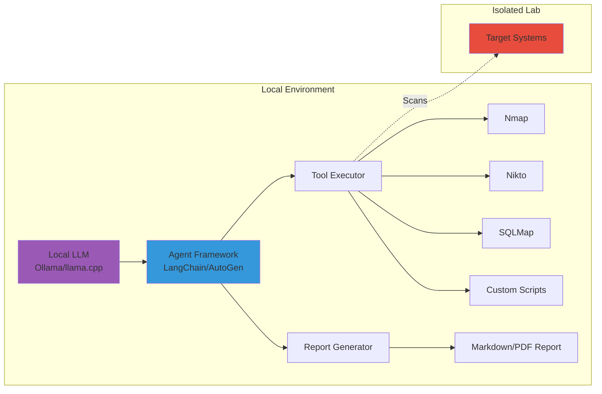

# Creating a Local LLM Agent for Penetration Testing & Reporting

Great idea! Running a **local LLM agent** gives you privacy, control, and the ability to automate security assessments. Here's a comprehensive guide:

---

## Architecture Overview



---

## 1. Local LLM Setup Options

### Option A: Ollama (Easiest)

```bash
# Install Ollama
curl -fsSL https://ollama.com/install.sh | sh

# Pull a capable model for security tasks
ollama pull llama3:70b          # Best reasoning (needs ~40GB RAM)
ollama pull llama3:8b           # Good balance (needs ~8GB RAM)
ollama pull codellama:34b       # Great for code analysis
ollama pull mixtral:8x7b        # Strong for complex tasks

# Verify it's running
ollama list
```

### Option B: llama.cpp (More Control)

```bash
# Clone and build
git clone https://github.com/ggerganov/llama.cpp
cd llama.cpp
make -j

# Run with a GGUF model
./main -m models/llama-3-8b.gguf -c 4096 --interactive
```

### Option C: LocalAI (OpenAI-compatible API)

```bash
# Run as Docker container
docker run -p 8080:8080 -v $PWD/models:/models localai/localai:latest
```

---

## 2. Agent Framework Setup

### Project Structure

```
pentest-agent/
├── agent/
│   ├── __init__.py
│   ├── core.py           # Main agent logic
│   ├── tools.py          # Pentest tool wrappers
│   ├── prompts.py        # System prompts
│   └── report.py         # Report generation
├── config/
│   └── settings.yaml
├── reports/
├── requirements.txt
└── main.py
```

### Requirements

```txt
# requirements.txt
langchain>=0.1.0
langchain-community>=0.0.10
ollama>=0.1.0
pydantic>=2.0
python-nmap>=0.7.1
jinja2>=3.1.0
markdown>=3.5
weasyprint>=60.0  # For PDF generation
rich>=13.0        # Nice terminal output
```

---

## 3. Core Agent Implementation

### `agent/prompts.py` - System Prompts

```python
PENTEST_SYSTEM_PROMPT = """You are an expert penetration tester and security analyst. 
You operate in an ISOLATED LAB ENVIRONMENT with explicit authorization.

Your responsibilities:
1. Systematically enumerate and scan target systems
2. Identify vulnerabilities using appropriate tools
3. Attempt safe exploitation when vulnerabilities are found
4. Document all findings with evidence
5. Provide remediation recommendations

Available tools:
- nmap_scan: Network discovery and port scanning
- nikto_scan: Web server vulnerability scanning
- dir_bruteforce: Directory enumeration
- sql_injection_test: SQL injection testing
- run_command: Execute custom commands

Always follow this methodology:
1. Reconnaissance → 2. Scanning → 3. Enumeration → 4. Exploitation → 5. Reporting

Be thorough, methodical, and document everything."""

REPORT_SYSTEM_PROMPT = """You are a security report writer. 
Convert penetration test findings into professional, well-structured reports.
Include: Executive Summary, Methodology, Findings (with severity ratings), 
Evidence, and Remediation recommendations. Use CVSS scoring where applicable."""
```

### `agent/tools.py` - Tool Wrappers

```python
import subprocess
import nmap
from typing import Optional
from pydantic import BaseModel, Field


class ToolResult(BaseModel):
    tool: str
    command: str
    output: str
    success: bool
    error: Optional[str] = None


def nmap_scan(target: str, scan_type: str = "basic") -> ToolResult:
    """
    Perform nmap scan on target.
    scan_type: basic, full, vuln, stealth
    """
    nm = nmap.PortScanner()
    
    scan_args = {
        "basic": "-sV -sC",
        "full": "-sV -sC -p- -T4",
        "vuln": "-sV --script vuln",
        "stealth": "-sS -T2"
    }
    
    args = scan_args.get(scan_type, "-sV")
    
    try:
        nm.scan(target, arguments=args)
        output = []
        for host in nm.all_hosts():
            output.append(f"Host: {host} ({nm[host].hostname()})")
            output.append(f"State: {nm[host].state()}")
            for proto in nm[host].all_protocols():
                ports = nm[host][proto].keys()
                for port in sorted(ports):
                    state = nm[host][proto][port]['state']
                    service = nm[host][proto][port]['name']
                    version = nm[host][proto][port].get('version', '')
                    output.append(f"  {port}/{proto} {state} {service} {version}")
        
        return ToolResult(
            tool="nmap",
            command=f"nmap {args} {target}",
            output="\n".join(output),
            success=True
        )
    except Exception as e:
        return ToolResult(
            tool="nmap",
            command=f"nmap {args} {target}",
            output="",
            success=False,
            error=str(e)
        )


def nikto_scan(target: str, port: int = 80) -> ToolResult:
    """Run Nikto web vulnerability scanner."""
    cmd = ["nikto", "-h", f"{target}:{port}", "-Format", "txt"]
    try:
        result = subprocess.run(cmd, capture_output=True, text=True, timeout=300)
        return ToolResult(
            tool="nikto",
            command=" ".join(cmd),
            output=result.stdout,
            success=result.returncode == 0,
            error=result.stderr if result.returncode != 0 else None
        )
    except subprocess.TimeoutExpired:
        return ToolResult(
            tool="nikto",
            command=" ".join(cmd),
            output="",
            success=False,
            error="Scan timed out after 5 minutes"
        )


def dir_bruteforce(target: str, wordlist: str = "/usr/share/wordlists/dirb/common.txt") -> ToolResult:
    """Directory bruteforce using gobuster or ffuf."""
    cmd = ["gobuster", "dir", "-u", target, "-w", wordlist, "-q"]
    try:
        result = subprocess.run(cmd, capture_output=True, text=True, timeout=600)
        return ToolResult(
            tool="gobuster",
            command=" ".join(cmd),
            output=result.stdout,
            success=True
        )
    except Exception as e:
        return ToolResult(
            tool="gobuster",
            command=" ".join(cmd),
            output="",
            success=False,
            error=str(e)
        )


def run_command(command: str, timeout: int = 60) -> ToolResult:
    """Execute a shell command (use with caution)."""
    # Safety: block dangerous commands
    blocked = ["rm -rf", "mkfs", "dd if=", "> /dev/"]
    if any(b in command for b in blocked):
        return ToolResult(
            tool="shell",
            command=command,
            output="",
            success=False,
            error="Command blocked for safety"
        )
    
    try:
        result = subprocess.run(
            command, shell=True, capture_output=True, text=True, timeout=timeout
        )
        return ToolResult(
            tool="shell",
            command=command,
            output=result.stdout + result.stderr,
            success=result.returncode == 0
        )
    except Exception as e:
        return ToolResult(
            tool="shell",
            command=command,
            output="",
            success=False,
            error=str(e)
        )
```

### `agent/core.py` - Main Agent

```python
import json
from typing import Callable
from ollama import Client
from rich.console import Console
from rich.panel import Panel

from .prompts import PENTEST_SYSTEM_PROMPT
from .tools import nmap_scan, nikto_scan, dir_bruteforce, run_command, ToolResult

console = Console()


class PentestAgent:
    def __init__(self, model: str = "llama3:8b", target: str = None):
        self.client = Client()
        self.model = model
        self.target = target
        self.findings = []
        self.conversation = []
        
        # Register available tools
        self.tools = {
            "nmap_scan": nmap_scan,
            "nikto_scan": nikto_scan,
            "dir_bruteforce": dir_bruteforce,
            "run_command": run_command,
        }
        
        # Tool definitions for the LLM
        self.tool_definitions = [
            {
                "type": "function",
                "function": {
                    "name": "nmap_scan",
                    "description": "Scan target for open ports and services",
                    "parameters": {
                        "type": "object",
                        "properties": {
                            "target": {"type": "string", "description": "IP or hostname"},
                            "scan_type": {
                                "type": "string",
                                "enum": ["basic", "full", "vuln", "stealth"],
                                "description": "Type of scan"
                            }
                        },
                        "required": ["target"]
                    }
                }
            },
            {
                "type": "function",
                "function": {
                    "name": "nikto_scan",
                    "description": "Scan web server for vulnerabilities",
                    "parameters": {
                        "type": "object",
                        "properties": {
                            "target": {"type": "string"},
                            "port": {"type": "integer", "default": 80}
                        },
                        "required": ["target"]
                    }
                }
            },
            {
                "type": "function",
                "function": {
                    "name": "dir_bruteforce",
                    "description": "Enumerate directories on web server",
                    "parameters": {
                        "type": "object",
                        "properties": {
                            "target": {"type": "string", "description": "Full URL"}
                        },
                        "required": ["target"]
                    }
                }
            },
            {
                "type": "function",
                "function": {
                    "name": "run_command",
                    "description": "Run a shell command for custom testing",
                    "parameters": {
                        "type": "object",
                        "properties": {
                            "command": {"type": "string"}
                        },
                        "required": ["command"]
                    }
                }
            }
        ]
    
    def _call_tool(self, name: str, arguments: dict) -> ToolResult:
        """Execute a tool and return results."""
        if name in self.tools:
            console.print(f"[yellow]⚡ Executing: {name}[/yellow]")
            console.print(f"[dim]   Args: {arguments}[/dim]")
            result = self.tools[name](**arguments)
            self.findings.append(result)
            return result
        return ToolResult(
            tool=name, command="", output="", success=False, error="Tool not found"
        )
    
    def run(self, objective: str = None):
        """Run the penetration test agent."""
        if objective is None:
            objective = f"Perform a comprehensive penetration test on {self.target}"
        
        console.print(Panel(f"[bold green]Starting Pentest Agent[/bold green]\n"
                           f"Target: {self.target}\nModel: {self.model}"))
        
        self.conversation = [
            {"role": "system", "content": PENTEST_SYSTEM_PROMPT},
            {"role": "user", "content": f"Target: {self.target}\nObjective: {objective}\n\n"
                                        "Begin the penetration test. Start with reconnaissance."}
        ]
        
        max_iterations = 20
        for i in range(max_iterations):
            console.print(f"\n[bold cyan]━━━ Iteration {i+1}/{max_iterations} ━━━[/bold cyan]")
            
            response = self.client.chat(
                model=self.model,
                messages=self.conversation,
                tools=self.tool_definitions
            )
            
            message = response['message']
            
            # Check if the agent wants to use tools
            if message.get('tool_calls'):
                tool_results = []
                for tool_call in message['tool_calls']:
                    func_name = tool_call['function']['name']
                    func_args = json.loads(tool_call['function']['arguments'])
                    
                    result = self._call_tool(func_name, func_args)
                    tool_results.append({
                        "tool": func_name,
                        "result": result.model_dump()
                    })
                    
                    console.print(Panel(result.output[:500] + "..." if len(result.output) > 500 
                                       else result.output, title=f"[green]{func_name} Output[/green]"))
                
                # Add tool results to conversation
                self.conversation.append({"role": "assistant", "content": None, "tool_calls": message['tool_calls']})
                self.conversation.append({"role": "tool", "content": json.dumps(tool_results)})
            
            else:
                # Agent is providing analysis or is done
                console.print(Panel(message['content'], title="[blue]Agent Analysis[/blue]"))
                self.conversation.append({"role": "assistant", "content": message['content']})
                
                # Check if agent indicates completion
                if any(word in message['content'].lower() for word in 
                       ["completed", "finished", "conclude", "final report"]):
                    console.print("[bold green]✓ Penetration test completed![/bold green]")
                    break
                
                # Prompt to continue
                self.conversation.append({
                    "role": "user", 
                    "content": "Continue with the next phase of testing, or generate the final report if complete."
                })
        
        return self.findings
```

---

## 4. Report Generator

### `agent/report.py`

```python
from datetime import datetime
from pathlib import Path
from jinja2 import Template
from ollama import Client

from .prompts import REPORT_SYSTEM_PROMPT


REPORT_TEMPLATE = """
# Penetration Test Report

**Target:** {{ target }}  
**Date:** {{ date }}  
**Tester:** Automated LLM Agent  

---

## Executive Summary

{{ executive_summary }}

---

## Methodology

{{ methodology }}

---

## Findings


### {{ finding.title }}

| Attribute | Value |
|-----------|-------|
| **Severity** | {{ finding.severity }} |
| **CVSS Score** | {{ finding.cvss }} |
| **Affected Component** | {{ finding.component }} |

**Description:**  
{{ finding.description }}

**Evidence:**
```
{{ finding.evidence }}
```

**Remediation:**  
{{ finding.remediation }}

---


## Conclusion

{{ conclusion }}

---

*Report generated automatically by PentestAgent*
"""


class ReportGenerator:
    def __init__(self, model: str = "llama3:8b"):
        self.client = Client()
        self.model = model
    
    def generate(self, target: str, findings: list, output_path: str = "reports/"):
        """Generate a penetration test report from findings."""
        
        # Prepare findings summary for LLM
        findings_text = "\n\n".join([
            f"Tool: {f.tool}\nCommand: {f.command}\nOutput:\n{f.output[:2000]}"
            for f in findings if f.success
        ])
        
        # Ask LLM to analyze and structure findings
        analysis_prompt = f"""Analyze these penetration test results and provide:
1. An executive summary (2-3 paragraphs)
2. A list of vulnerabilities found with:
   - Title
   - Severity (Critical/High/Medium/Low/Info)
   - CVSS score estimate
   - Affected component
   - Description
   - Remediation recommendation
3. A conclusion

Raw findings:
{findings_text}

Respond in JSON format with keys: executive_summary, methodology, findings (array), conclusion"""

        response = self.client.chat(
            model=self.model,
            messages=[
                {"role": "system", "content": REPORT_SYSTEM_PROMPT},
                {"role": "user", "content": analysis_prompt}
            ],
            format="json"
        )
        
        import json
        report_data = json.loads(response['message']['content'])
        
        # Render template
        template = Template(REPORT_TEMPLATE)
        report_md = template.render(
            target=target,
            date=datetime.now().strftime("%Y-%m-%d %H:%M"),
            **report_data
        )
        
        # Save report
        Path(output_path).mkdir(exist_ok=True)
        timestamp = datetime.now().strftime("%Y%m%d_%H%M%S")
        
        md_path = Path(output_path) / f"pentest_report_{timestamp}.md"
        md_path.write_text(report_md)
        
        # Generate PDF (optional)
        try:
            from weasyprint import HTML, CSS
            import markdown
            
            html_content = markdown.markdown(report_md, extensions=['tables', 'fenced_code'])
            html_full = f"<html><body>{html_content}</body></html>"
            
            pdf_path = Path(output_path) / f"pentest_report_{timestamp}.pdf"
            HTML(string=html_full).write_pdf(pdf_path)
            print(f"PDF report saved: {pdf_path}")
        except ImportError:
            print("WeasyPrint not installed, skipping PDF generation")
        
        print(f"Markdown report saved: {md_path}")
        return md_path
```

---

## 5. Main Entry Point

### `main.py`

```python
#!/usr/bin/env python3
import argparse
from agent.core import PentestAgent
from agent.report import ReportGenerator


def main():
    parser = argparse.ArgumentParser(description="Local LLM Penetration Testing Agent")
    parser.add_argument("target", help="Target IP or hostname")
    parser.add_argument("--model", default="llama3:8b", help="Ollama model to use")
    parser.add_argument("--objective", default=None, help="Specific testing objective")
    parser.add_argument("--report-only", action="store_true", help="Generate report from previous findings")
    
    args = parser.parse_args()
    
    print("""
    ╔═══════════════════════════════════════════╗
    ║     🔒 Local LLM Pentest Agent 🔒         ║
    ║   ⚠️  Use only in authorized environments  ║
    ╚═══════════════════════════════════════════╝
    """)
    
    # Confirmation
    confirm = input(f"Confirm you have authorization to test {args.target}? [yes/no]: ")
    if confirm.lower() != "yes":
        print("Aborting. Authorization required.")
        return
    
    # Run the agent
    agent = PentestAgent(model=args.model, target=args.target)
    findings = agent.run(objective=args.objective)
    
    # Generate report
    print("\n📝 Generating report...")
    reporter = ReportGenerator(model=args.model)
    report_path = reporter.generate(target=args.target, findings=findings)
    
    print(f"\n✅ Complete! Report saved to: {report_path}")


if __name__ == "__main__":
    main()
```

---

## 6. Running the Agent

```bash
# Install dependencies
pip install -r requirements.txt

# Make sure Ollama is running with your model
ollama serve &
ollama pull llama3:8b

# Run against your isolated lab target
python main.py 192.168.56.101 --model llama3:8b

# With specific objective
python main.py 192.168.56.101 --objective "Focus on web application vulnerabilities on port 80"
```

---

## 7. Recommended Local Models for Pentesting

| Model | Size | Best For | RAM Needed |
|-------|------|----------|------------|
| **Llama 3 70B** | 40GB | Complex reasoning, best results | 48GB+ |
| **Llama 3 8B** | 4.7GB | Good balance | 8GB |
| **Mixtral 8x7B** | 26GB | Strong multi-step reasoning | 32GB |
| **CodeLlama 34B** | 19GB | Code analysis, exploit dev | 24GB |
| **Deepseek Coder** | 7-33GB | Code review | 8-40GB |

---

## ⚠️ Important Considerations

> **Legal & Ethical:**
> - Only test systems you **own** or have **written authorization** for
> - Keep everything in an **isolated lab environment**
> - This is for **educational purposes** and authorized security testing only

> **Technical:**
> - Local LLMs may hallucinate - always verify findings manually
> - Consider adding human-in-the-loop confirmation for dangerous actions
> - Log everything for audit purposes

---

## Next Steps

Would you like me to elaborate on:

1. **Adding more tools** (SQLMap, Metasploit integration, custom exploits)?
2. **Improving agent reasoning** with chain-of-thought prompting?
3. **Multi-agent setup** (separate recon, exploitation, and reporting agents)?
4. **Web UI** for monitoring the agent's progress?